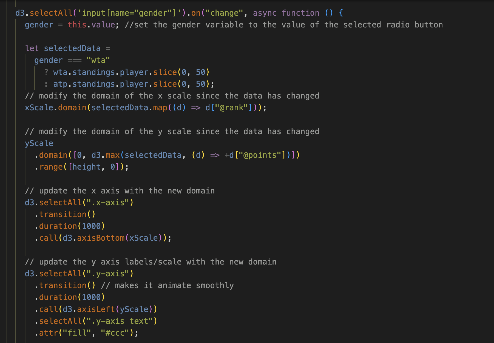
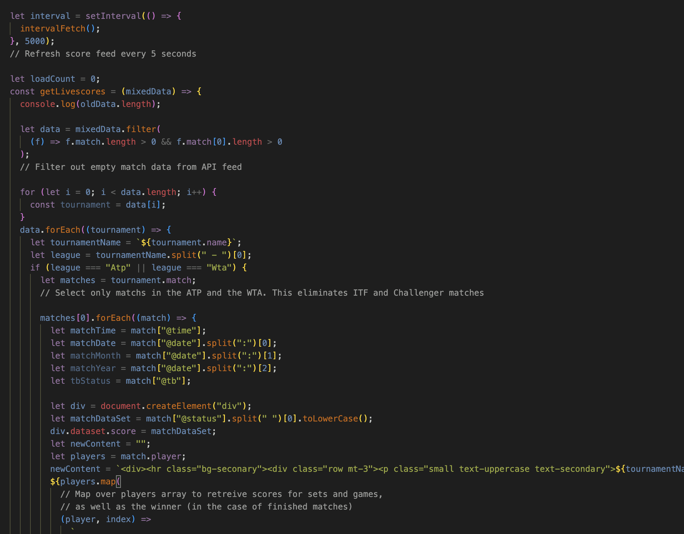

# HotNets

Hosted at: https://hotnets.herokuapp.com/

## Tennis Data Visualization for Sportsbetters

### Background

Gamblers who bet on tennis matches may have dozens of daily matches to evaluate when choosing their positions. Because of the unique draw system, and the nature of the game itself, which pits single players against each other, professional tennis offers an opportunity for sportsbetters looking for a narrow risk profile.

The reality is that most tennis matches are won by the player who is favored to win. These matches, although fairly predictable offer very low return for the risk taken on by the better. A highly ranked player who is playing a very low ranked player may have -1000 odds, which return only 10% on the bet.

The ideal matches to bet are not just matches whose outcome the better can predict, but matches in which the underdog(the lower-ranked player or player least favorite by the bookmakers) has a higher likelihood to win. A lower-ranker player may have, for instance, +1000 odds to win (and payout 10x the risk), even though dedicated fans can see they are rapidly rising in the ranks and are more likely to outperform the expections of the bookmakers. These matches are where Hot Nets are born.

Hot Nets will provide a novel set of tools for sportsbetting on tennis.

Via HotNets, users will be able to:

- Compare players sranks for live, finished and upcoming tennis matches.
- View scores and stats for live and finished matches.
- Explore live ranking data for top 50 players, including movement (up, down, same indicators)
- Follow live scores via feed automatically updated every 5 seconds.

### Functionality & MVPs

- Live Scores (Autotmatically refreshed every 5 seconds)
- Live, Finished and Upcoming Matches
- Single Player Ranking for ATP and WTA players
- Filter/display matches by status
- Review score lines for matches finished in the previous 24 hours

### Wireframes

#### Hot Nets Home Page

### Technologies, Libraries, APIs

_APIs for Tennis Data_

- GoalServe https://goalserve.com/en/sport-data-feeds/tennis-api/description

_Libraries_

- D3 Library for Bar Char Rankings Visualization

### Code Examples

**Dynamic chart displaying ranks for both ATP and WTA leagues**
The user can select either the ATP or the WTA and the chart will automatically adjust the graph scale. The data for both leagues arrives in seperate JSON objects via two different APIs.

** Acesses live score data every five seconds, santize and filter output to fit our requirements. 

### Implementation Timeline

#### Friday Afternoon & Weekend

- Connect data feeds for live scores, live and upcoming matches
- Create HTML page with placeholder data

#### Monday

- Create bar chart of ranking visualizations

#### Tuesday

- Create buttons to filter live/upcoming/finished games

#### Wednesday

- Connect to ranking API using player ID provided in match data

#### Thursday Morning

- CSS Styles
- Add Bar chart to home page

### Bonus

- Additional player profile information for individual matches
- Add odds data from top bookmakers to match feed
- Point by Point Match Visualizations

