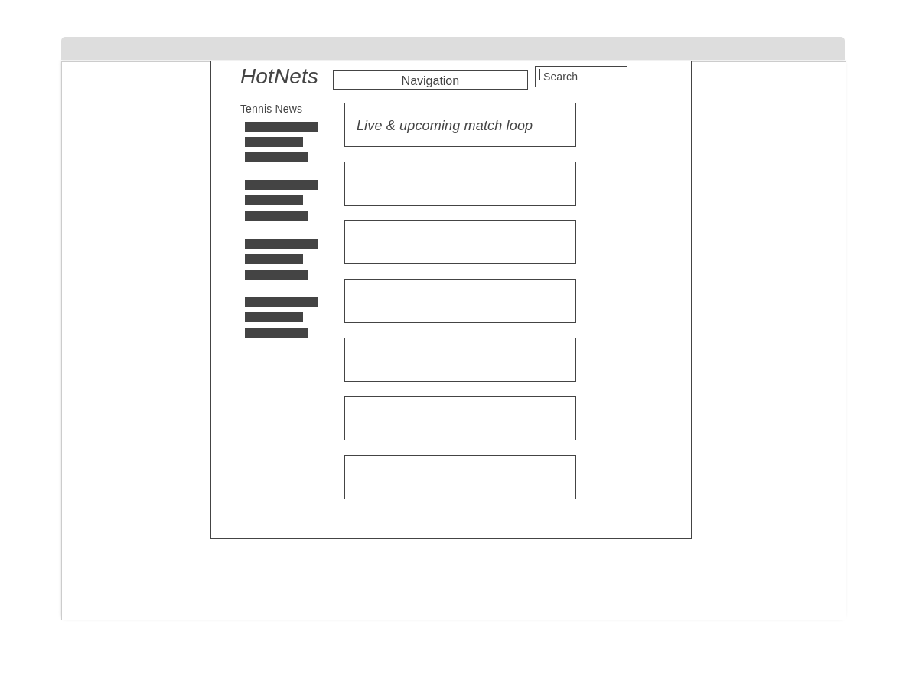
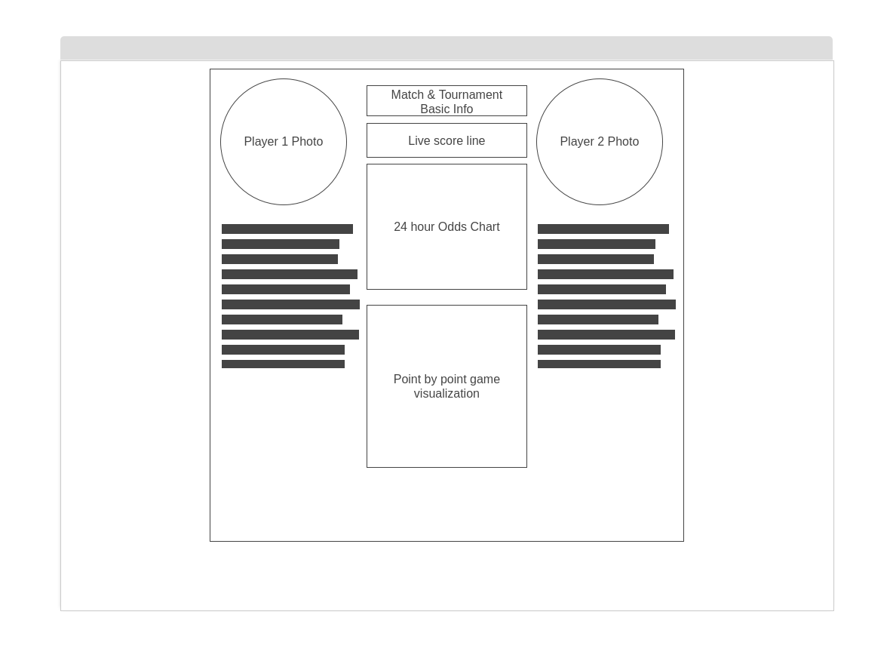
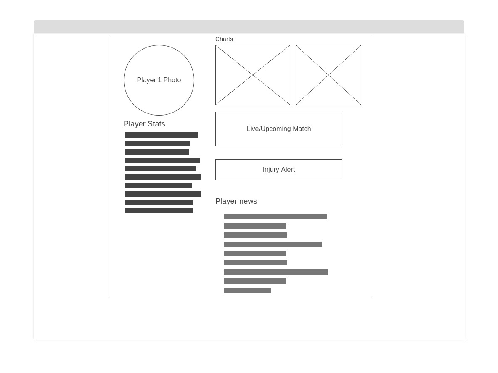

# HotNets
Hosted at: https://hotnets.herokuapp.com/
## Tennis Data Visualization for Sportsbetters 

### Background

Gamblers who bet on tennis matches may have dozens of daily matches to evaluate when choosing their positions. Because of the unique draw system, and the nature of the game itself, which pits single players against each other, professional tennis offers an opportunity for sportsbetters looking for a narrow risk profile. 

The reality is that most tennis matches are won by the player who is favored to win. These matches, although fairly predictable offer very low return for the risk taken on by the better. A highly ranked player who is playing a very low ranked player may have -1000 odds, which return only 10% on the bet. 

The ideal matches to bet are not just matches whose outcome the better can predict, but matches in which the underdog(the lower-ranked player or player least favorite by the bookmakers) has a higher likelihood to win. A lower-ranker player may have, for instance, +1000 odds to win (and payout 10x the risk), even though dedicated fans can see they are rapidly rising in the ranks and are more likely to outperform the expections of the bookmakers. These matches are where Hot Nets are born.

Hot Nets will provide a novel set of tools for sportsbetting on tennis. 

Via HotNets, users will be able to:

* Compare players stats for live and upcoming tennis matches.
* View scores and stats for live games.
* Track betting odds during the day leading up to the match time and trends in odds during live match play.
* Sort live matches by "hotness," i.e. favorable risk opportunites.
* Visualize matches by point-to-point refreshed every 60 seconds.

### Functionality & MVPs

* Live Scores
* Live and Upcoming Matches
* Single Player Data
* Head 2 Head Player Comparisons
* Point by Point Match Visualizations

### Wireframes
#### Hot Nets Home Page

#### Single Match Page

#### Single Player Page

### Technologies, Libraries, APIs
*APIs for Tennis Data*
* Tennis Data Live https://rapidapi.com/sportcontentapi/api/tennis-live-data/
* SportRadar https://developer.sportradar.com/docs/read/tennis/Tennis_v3
* GoalServe https://goalserve.com/en/sport-data-feeds/tennis-api/description

*Libraries*
* D3 or Chart.js

### Implementation Timeline
Here's an entirely overly ambitious development schedule.

#### Friday Afternoon & Weekend
* Select and connect data feeds for live scores, live and upcoming matches
* Create 3 HTML pages with placeholder data 
#### Monday
* Chart odds data
* Single match page functionality
#### Tuesday
* Head 2 Head data, layout in HTML
* Single tournament pages, all tournaments page
#### Wednesday
* Live Point by point match visualization
#### Thursday Morning
* Single player page

### Bonus
* Tennis news feeds
* Twitter and instagram links for single player pages
